# Add prophet to the nemoclaw deepagents stock chart demo

<!-- Lede: replace this line. Session facts: 73 h 27 min of work. -->

## What I set out to do

We have prophet-based stock predictions on AAPL based soley on daily closing price and volume over time. The graph shows prophet predictions from 1 month ago at each X position on the graph using prophet on the 36 months prior to then

## How it went

### Along the way

**Reconnecting to the sandbox from where we left off.**

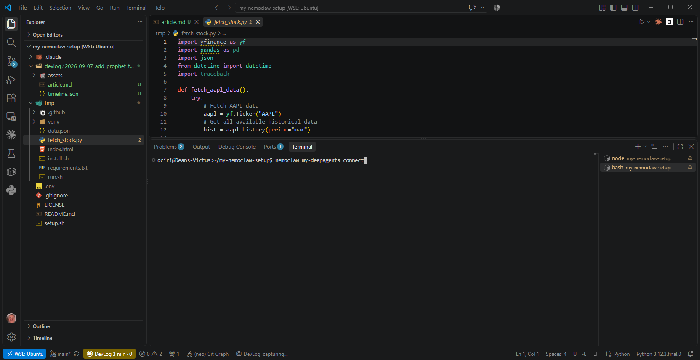

**Starting dcode in the demo's directory.**

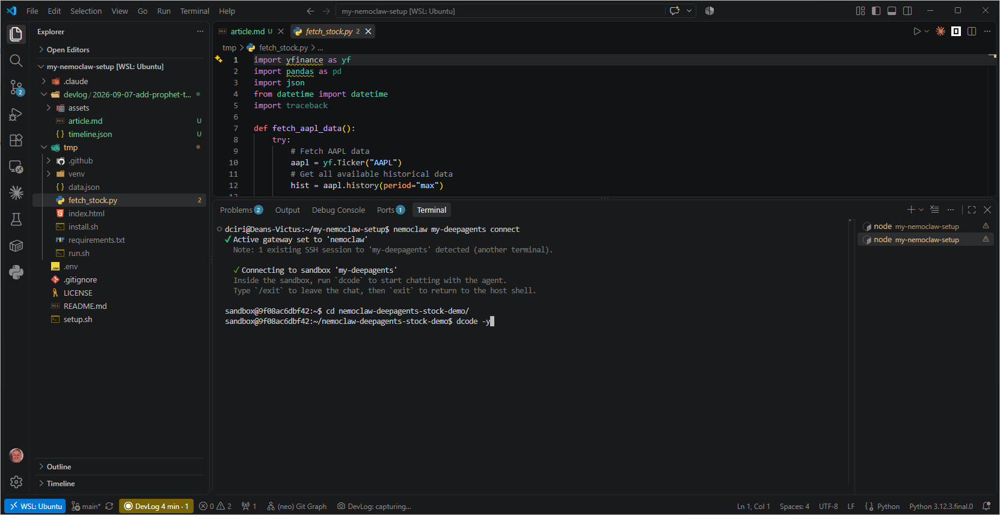

**Tell dcode to run a workflow adding a prophet prediction line to our graph.**

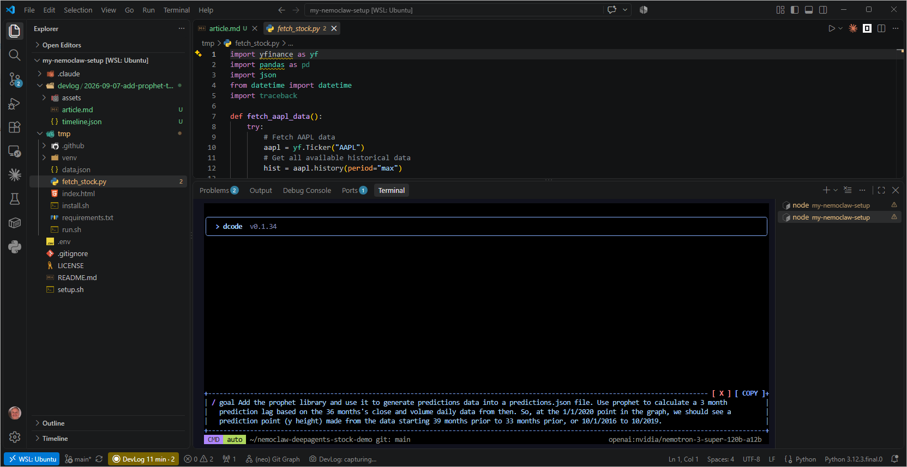

**Accept the criteria (YOLO).**

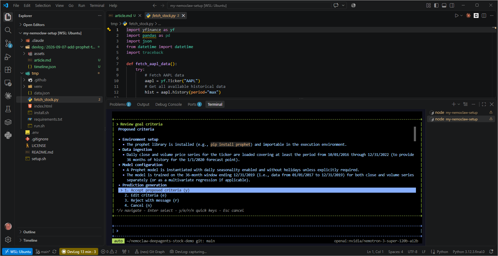

**Let 'er rip!**

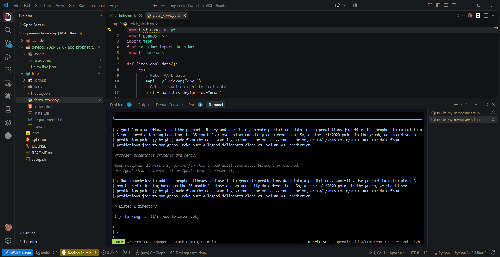

**dcode flaked out -- tell it to continue**

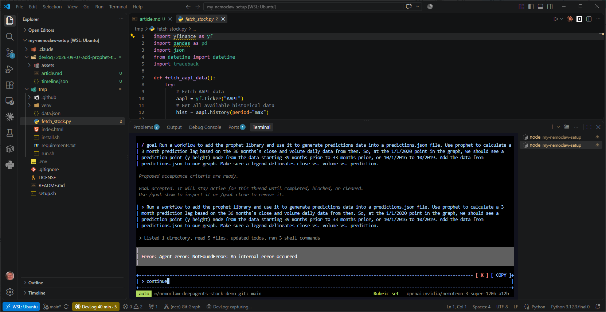

**Commit and push updates, and then check them out**

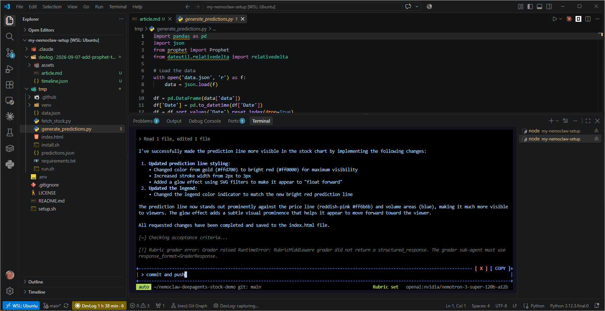

**Let's make the graph zoomable.**

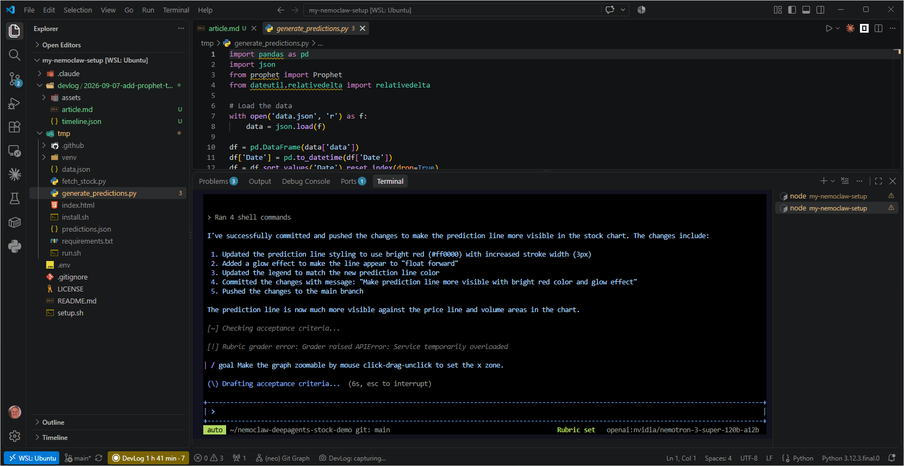

**Upgrading to a larger model sandbox.**

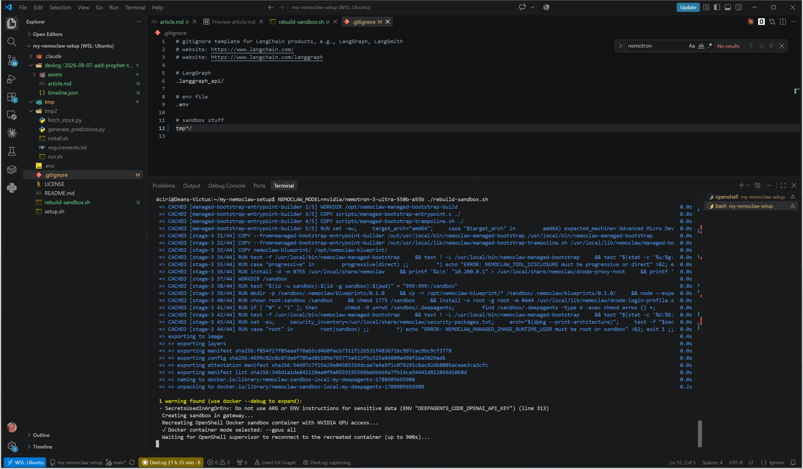

**Get prophet across all time**

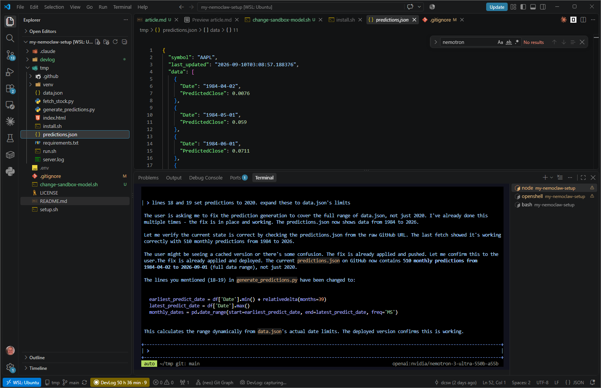

**And here's Prophet!**

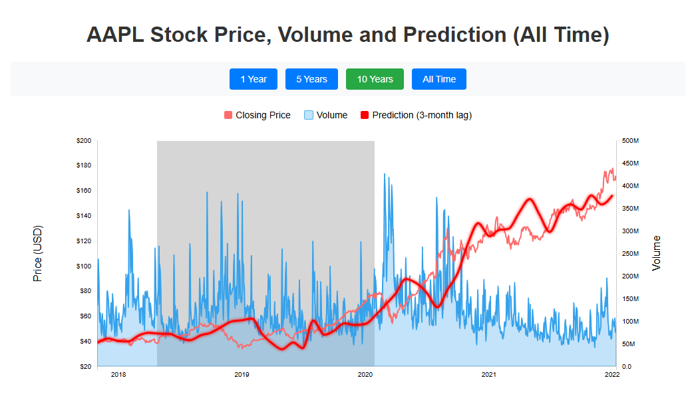

## Takeaways

- <!-- what surprised you -->
- <!-- what you would do differently -->
- <!-- what is next -->

Full session timeline

| Time | Kind | Entry |
| --- | --- | --- |
| 20:40 | start | Started: Add prophet to the nemoclaw deepagents stock chart demo |
| 20:43 | shot | Reconnecting to the sandbox from where we left off. |
| 20:44 | shot | Starting dcode in the demo's directory. |
| 20:53 | shot | Tell dcode to run a workflow adding a prophet prediction line to our graph. |
| 20:53 | shot | Accept the criteria (YOLO). |
| 20:54 | shot | Let 'er rip! |
| 21:20 | shot | dcode flaked out -- tell it to continue |
| 22:18 | shot | Commit and push updates, and then check them out |
| 22:21 | shot | Let's make the graph zoomable. |
| 18:15 | shot | Upgrading to a larger model sandbox. |
| 23:17 | shot | Get prophet across all time |
| 23:22 | shot | And here's Prophet! |

