# LinkedIn Article 2 -- Capital Moves

> **Goal.** We have a second graph showing money moving in and out of the security.

<!-- Write freely anywhere in this file. DevLog Scribe only ever inserts at the
     marker near the bottom, so your prose is never overwritten. -->

## Session log

### 21:46 · 🎬 Started: LinkedIn Article 2 -- Capital Moves

**Goal.** We have a second graph showing money moving in and out of the security.

### 21:47 · 📸 Screenshot

while looking at `devlog/2026-09-16-linkedin-article-2-capital-moves/article.md`

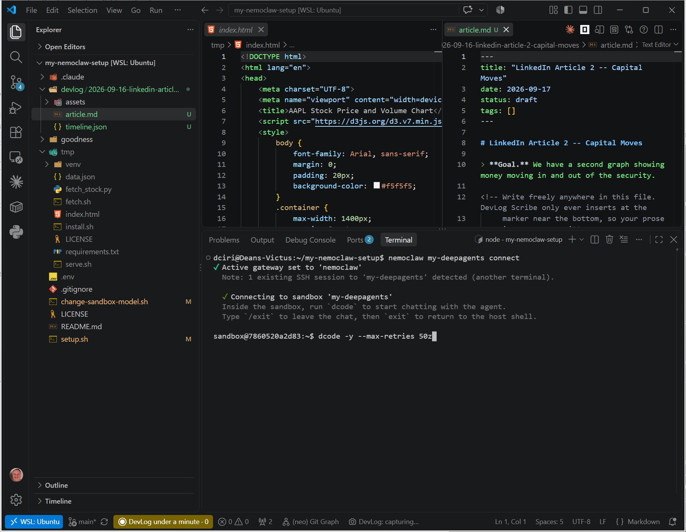

### 21:47 · 📸 Screenshot

while looking at `devlog/2026-09-16-linkedin-article-2-capital-moves/article.md`

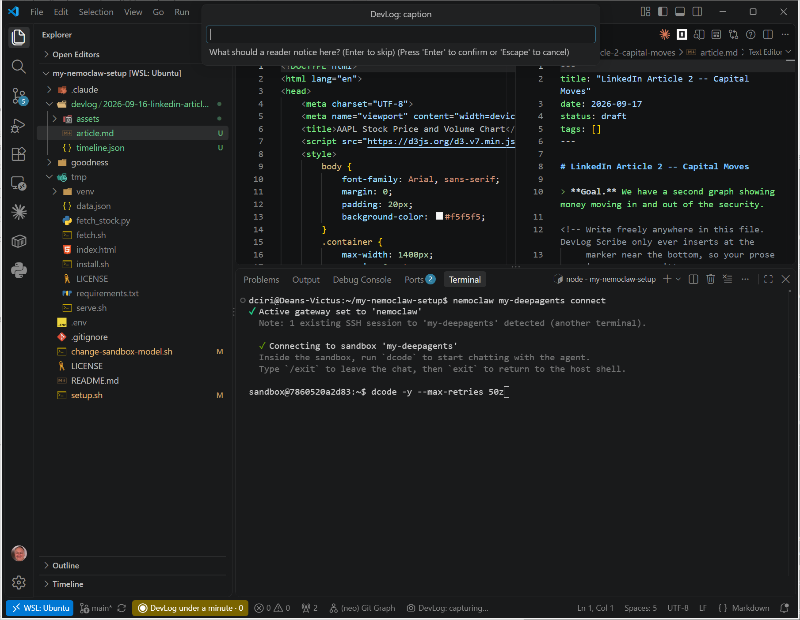

### 21:47 · 📸 Start dcode.

while looking at `devlog/2026-09-16-linkedin-article-2-capital-moves/article.md`

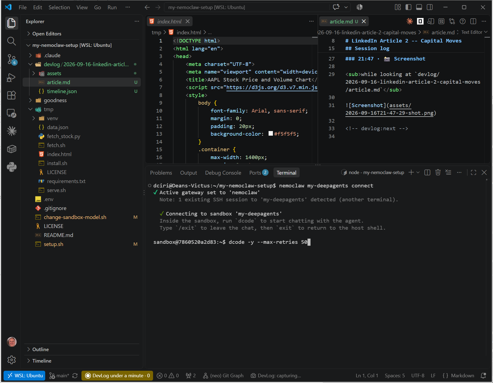

### 21:50 · 📸 Use /goal and specify our Captital Moves graph. Define Capital moves as volume times stock price at any point in time.

while looking at `devlog/2026-09-16-linkedin-article-2-capital-moves/article.md`

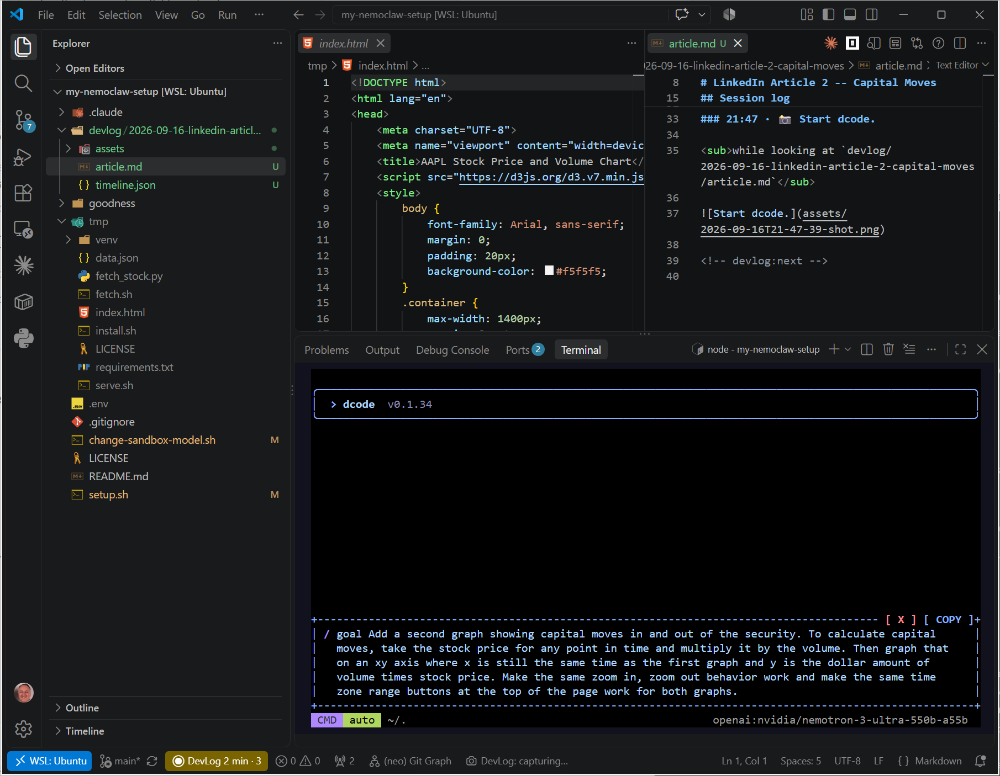

### 22:30 · 📸 Accept the generated criteria.

while looking at `setup.sh`

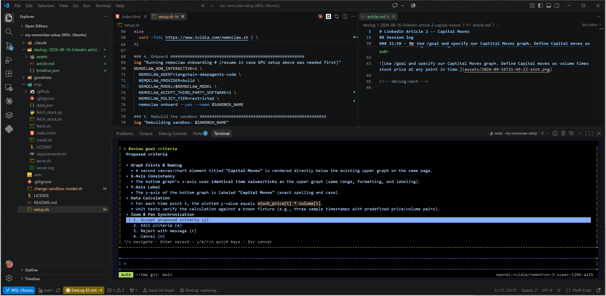

### 22:31 · 📸 If your connection drops or otherwise glitches, just continue....

while looking at `setup.sh`

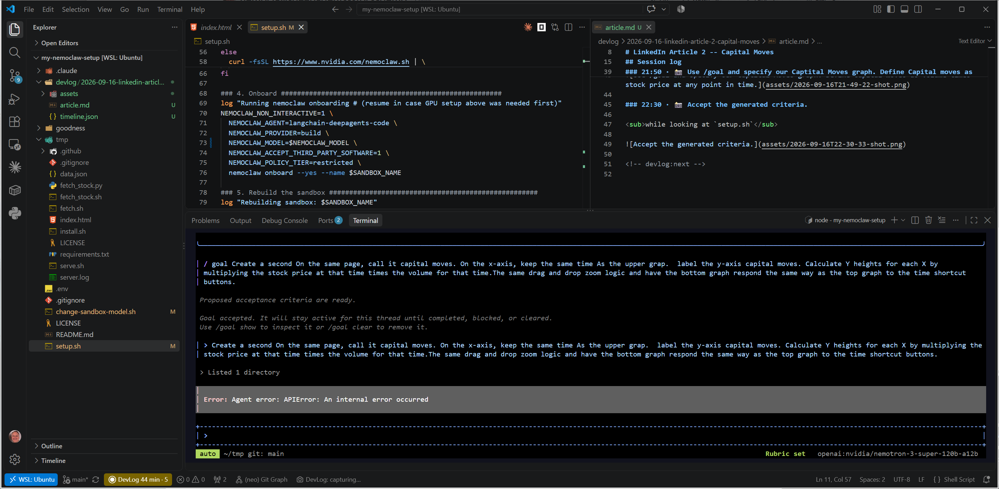

### 22:38 · 📸 Too many transient errors?

while looking at `setup.sh`

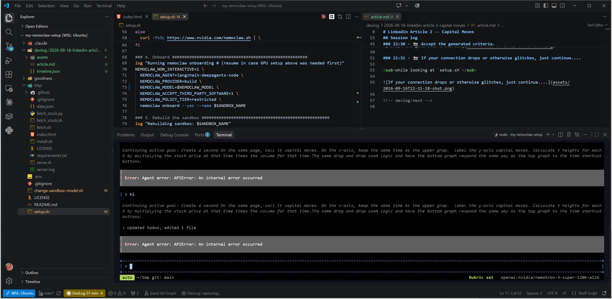

### 22:39 · 📸 Drop to the command line and have dcode run in headless retry mode.

while looking at `setup.sh`

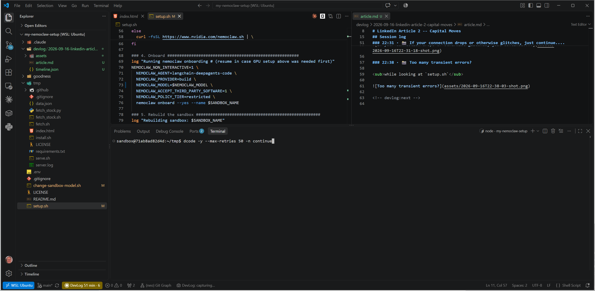

### 21:49 · 📸 Screenshot

while looking at `setup.sh`

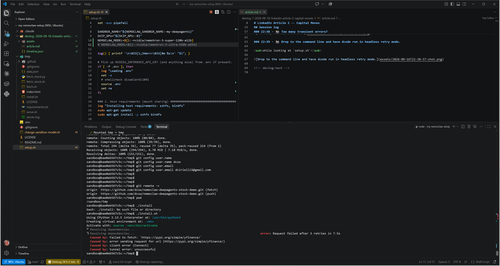

### 01:22 · 📸 Screenshot

while looking at `devlog/2026-09-16-linkedin-article-2-capital-moves/article.md`

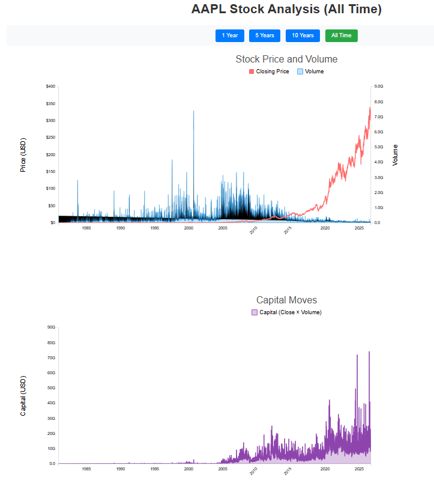

### 01:23 · 📸 And there it is! 2 synchonized charts with the second showing Captital Moves.

while looking at `devlog/2026-09-16-linkedin-article-2-capital-moves/article.md`

### 01:23 · 📌 Nailed it -- BAM!

Since the last entry: edits saved in setup.sh, .bashrc, nim-models.json, github-sandbox-pat +1 more

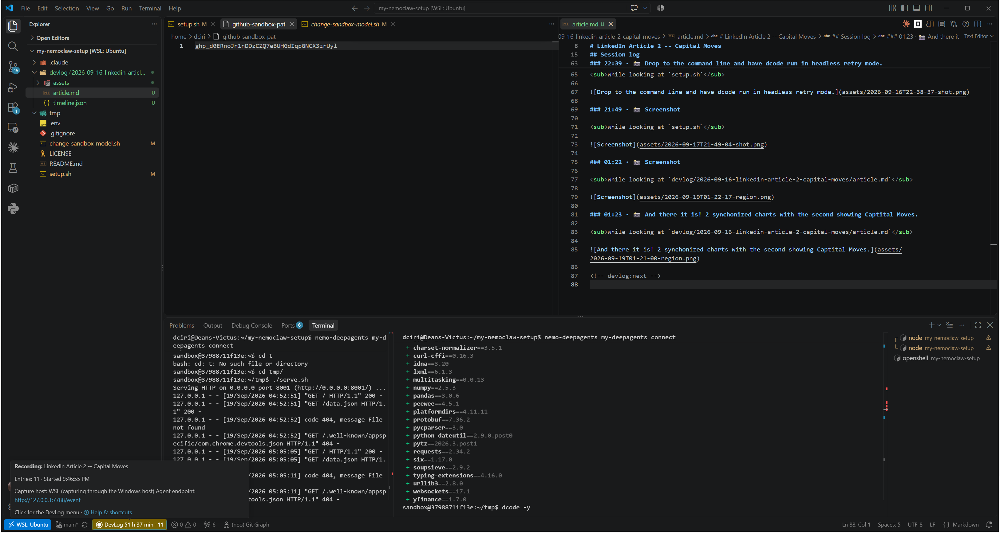

### 16:23 · 📸 xxxx

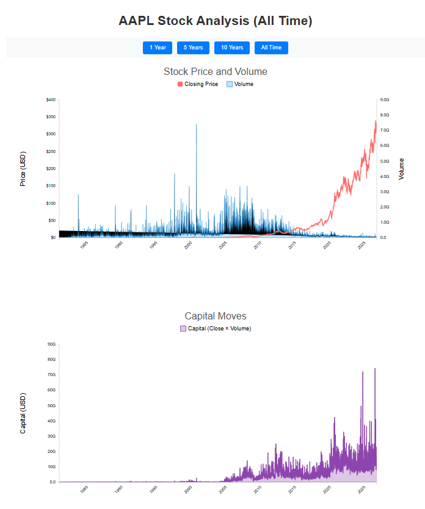

<!-- devlog:next -->
